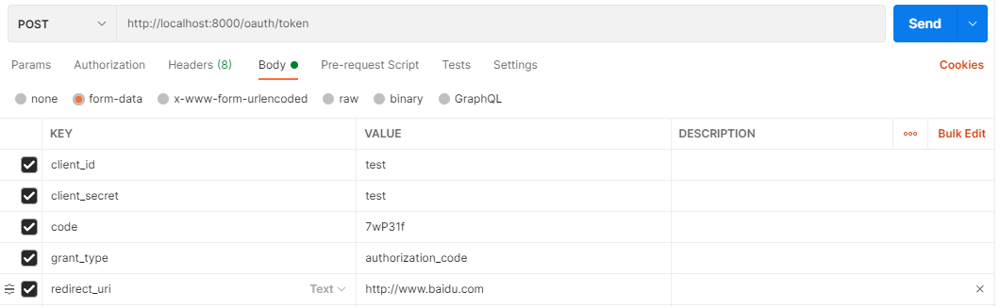

## 概要

基于Spring Cloud Alibaba方案的微服务框架。主要实现：

1. 授权中心
2. 用户中心
3. 消息中心（包括：内部消息、短信、邮件等）
4. 支付中心
5. 新闻中心
6. 订单中心
7. 广告中心

## 技术栈

该框架主要使用：

- Spring Cloud
- Spring Cloud Alibaba
- Spring Cloud Security OAuth2.0
- Nacos
- RocketMQ
- Sentinel
- Spring Cloud OpenFeign
- Spring Cloud Gateway
- MySQL
- MongoDB
- Redis
- Elasticsearch
- ……

后续有的话，继续加

## 模块列表

- docs
- future-api-gateway
- future-auth-center
- future-commons
- future-order-center
- future-user-center
- future-msg-center
- future-pay-center

## 用户登录

### OAuht2认证四种方式

#### 授权码模式

1. 申请授权码

   `授权码申请`接口：**[GET]** http://localhost:8000/oauth/authorize

   浏览器访问授权码接口，认证服务器重定向到`redirect_uri`并以？的方式，返回授权码。

   参数列表：

   | 参数            | 是否必须 | 说明                                             |
   | --------------- | -------- | ------------------------------------------------ |
   | client_id       | 是       | test为测试账号，具体账号需要申请                 |
   | response_type   | 是       | code                                             |
   | redirection_uri | 是       | 如：http://www.baidu.com，根据自己的情况自己实现 |

   例子：

   1. 浏览器访问：

      http://localhost:8000/oauth/authorize?client_id=test&response_type=code&redirection_uri=http://www.baidu.com

   2. 如果用户没有登陆，则跳转登陆页面，登陆成功后自动跳转授权页面。

   3. 如果用户已经登陆，则直接跳转授权页面。

   4. 在授权页面`Approve`和`Deny`，选择`Approve`点击`Authorize`按钮，批准授权。
   5. 不出意外，授权服务器会重定向到百度首页，并且带有参数，如：`https://www.baidu.com/?code=6YaaOb`。跳转到百度，是因为`redirection_uri`，`code`是获取到的授权码。
   6. `redirection_uri`的处理程序，在获取`code`后，继续请求授权服务器，获取token。

2. 申请token

   `token申请`接口：**[POST]** http://localhost:8000/oauth/token

   参数列表

   | 参数          | 是否必须 | 说明                                                         |
   | ------------- | -------- | ------------------------------------------------------------ |
   | client_id     | 是       | test为测试账号，具体账号需要申请                             |
   | client_secret | 是       | test为测试账号的秘钥，具体账号的秘钥需要申请                 |
   | code          | 是       | 授权码                                                       |
   | grant_type    | 是       | authorization_code                                           |
   | redirect_uri  | 是       | 如：http://www.baidu.com，根据自己的情况自己实现，但是必须和申请授权码一致 |

   例子：

   1. POST方式访问http://localhost:8000/oauth/token

      

3. 访问受限资源

#### implicit

#### password

#### client_credentials

#### refresh_token